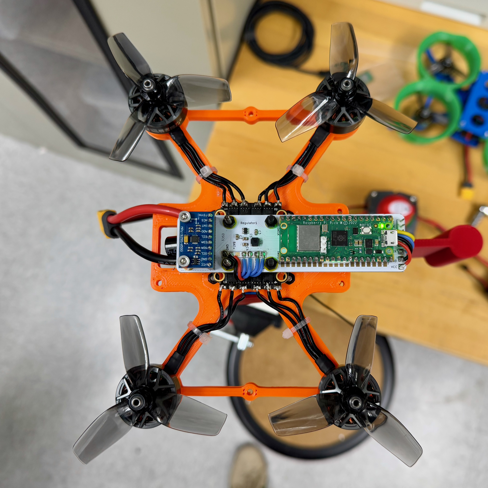
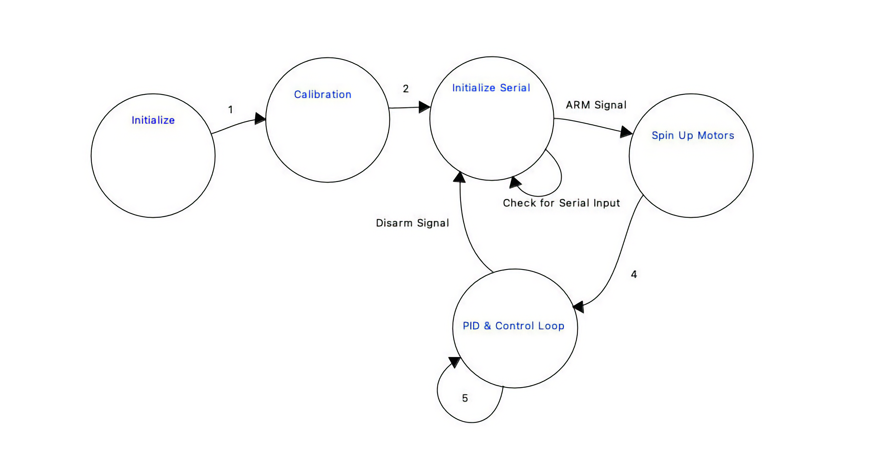

For the build guide, documentation, and more, please check out our [Wiki page](https://github.com/cornellmotionstudio/JacksonDronev2/wiki).

<p align="center">
    
</p>

# Getting Started

Clone the project
```
git clone https://github.com/nekrutnikolai/RotorRascal.git
```

Go to the software dir.
```
cd RotorRascal && cd software
```

Build the project

```
./builder
```

## Final Report Components

### Project Introduction
- One sentence "sound bite" that describes your project.
    We built and implemented PID control on a Pico-powered quadcopter to hover on a gimbal stand with throttle input from a controller. 

- A summary of what you did and why.
    

### High level design

- Rationale and sources of your project idea
    Bryan, Martin and I enjoy drones and quadcopters, we thought it would be a neat idea to develop a somewhat functioning flight controller to control the drone with an onboard IMU for orientation data, an external remote to set the throttle position, and an electronic speed controller (ESC). 
    
    Nikolai is a part of the Motion Studio "Drone Squad" advised by Dr. Beatriz Asfora which was involved in the creating of this final project idea. Out of the Drone Squad there was already a prototype developed by Deemo Chen with a PCB integrating an IMU and Pi Pico along with a skeleton of code on how to control each PWM ESC channel.

    The long-term objective of this project is to support the integration of these Pico-based drones made from 3D printed components into ECE and MAE courses. For instance, these drones could be integrated in the ECE microcontrollers curriculum and the students could work on code developing/tuning a PID controller. Or, for a MAE dynamics course, the students could use these drones for dynamics modelling.

- background math

    The effects of a $P$, $I$ and $D$ terms are well know. If we think of controlling the mass in a spring-mass-dashpot system, the $P$ term acts like increasing the stiffness of the spring, whereas the $D$ term effectively adds damping to the system. An $I$ term in general achieves the desirable porperty of having zero steady state. 

    Even though our system is not a spring-mass-dashpot system, we can still keep in mind the above intuitive properties of each of the three terms of a PID controller. 
    
    We ended up using the same set of three $P$, $I$, $D$ coefficients for controlling the pitch and the roll angle, and a different set of three $P$, $I$, $D$ coefficients for the yaw angle. Therefore, $6$ in total.

    We did not do any modelling of the drone ("plant") dynamics, and did the tuning by trial and error. With more time, we would obtain the quations of motion and linearize about the desired hover position. We would get a linear set of equations, keeping in mind that we should include . There would be two approaches: either design the controller using the state-space approach, or frequency design. 
    
    If we chose the state-space approach, 
       

- logical structure
    1. Initialize radio and sensors
    2. Calibrate ESCs and Gyro
    3. Initialize serial PID tuning interface
    4. Wait for arm signal from controller
        1. Erase all store PID values -- effectively reset controls
    5. Spin up motors to minimum throttle and begin executing PID loop
    6. Continue executing PID loop until disarm

<p align="center">
    
</p>

- hardware/software tradeoffs
    **PID loop speed:** Since the drone is a complicated, unstable system with 4 motors and 6 degrees of freedom, it is vital to have a fast control loop. From our testing and with lab 3, we found a value of 1kHz to work well. Compared to lab 3, we need to be computing the PID terms for 3 axes as opposed to a single PID axis. Those three axes are pitch, roll, and yaw. Pitch and roll have the same PID parameters and yaw has different PID parameters that will be discussed later in this section. 

    **Pico W:** The Pico W was used to allow future expansion of wireless capabilites. Future work could involve developing a web server that hosts an interactive PID tuning interface where students in courses could drag sliders and visualize the gyro output and controller output to see the performance of the PID developed or the drone modelled.

    **Controlling 4 Motors:** The PWM needs to be computed for each of the 4 motors, as opposed to a single axis like in lab 3, which takes more time to compute. This point is combined with the previous point made above, leading to significantly more computation involved. Essentially, 6 (PID terms) x 3 (axes) x 4 (motors) = 64 times the amount of computation relative to lab 3 since that lab had 1 axis and 1 motor. Additionally, changing the motor output has effects on the physical system, where changing the motor speed induces a torque on the drone, affecting the yaw axis, which will be discussed in the next section.

    **Yaw Compensation:** Since the drone is a physical system, we had to take into account physics for our software development and development. The quick and dirty solution that we came up with was having different PID weights for the yaw axis as opposed to the pitch and roll axes. For instance, the D term had to be greatly reduced as so the yaw compensation would not fight the other axes and enter an unstable jittery mess.

    **Long-Term Gyro Drift:** Gyro drift could have an effect on the longer-term characteristics in the minute to hour timescales. This is not much of a concern, however, as the drone only has battery life for 5 minutes at most due to the extreme power draw of flight. We implemented the gyro to calibrate everytime a battery is plugged in, so setting 

- Discuss existing patents, copyrights, and trademarks which are relevant to your project.
    There are no existing patents, copyrights, and trademarks which are relevant to our project.

### Program/hardware design
- program details. What parts were tricky to write?
    The skeleton of code we started from was unnecessarily complicated, so our biggest challenge was discovering how the actual control algorithms and peripheral interfaces were implemented. The code for the radio interface was reverse-engineered based on the serial string received from the controller. Although that was straightforward, it was far less straightforward to implement pitch, roll, and yaw control from the controller to the rest of the code. Hence, we stuck with throttle and arm only. From there, we scrapped his PID control as it was unfinished and did not work and wrote our own. This has its own challenges as we are implementing it on a quadcopter with four motors. One really important thing that we realized early was that the physical model for how yaw is controlled is extremely different from how pitch and roll is controlled. This means we needed separate coefficients for yaw PID and pitch/roll PID. To implement this, we simply compute the PID values, then apply the coefficients separately in the motor mixing calculations. 
  
- Hardware details -- Could someone else build this based on what you have written?

> Insert image of labelled diagram showcasing components

<p align="center">
    
</p>

Since drones out of the same parts 

    - Make this into a build guide!
    - This is already developed
    - Add bill of materials

Table 1: Drone components (UPDATE)

| **Component**         | **Part Description**                                        | **Estimated Price**     |
|------------------------|-------------------------------------------------------------|--------------------------|
| **Frame**              | 5" carbon fiber frame for freestyle or racing              | $30–$70                  |
| **Motors**             | 2207 or 2306 brushless motors, 1700–2500KV                 | $15–$30 each             |
| **ESC (4-in-1)**       | 4-in-1 ESC, 30–60A, DShot600 support                        | $40–$80                  |
| **Propellers**         | 5" tri-blade props (e.g., 5x4.3x3)                          | $3–$6 per set            |
| **Radio Receiver (Rx)**| ELRS, Crossfire, or FrSky protocol receiver                | $15–$30                  |
| **Battery**            | 4S or 6S LiPo, 1300–1800mAh                                 | $25–$50                  |
| **Transmitter (Tx)**   | RC controller (e.g., Radiomaster, Tango 2)                 | $100–$250                |

Table 2: Drone accessories (UPDATE)

| **Component**         | **Part Description**                                        | **Estimated Price**     |
|------------------------|-------------------------------------------------------------|--------------------------|
| **Transmitter (Tx)**   | RC controller (e.g., Radiomaster TX16S, TBS Tango 2)       | $100–$250                |
| **Battery Charger**    | LiPo balance charger (AC/DC or DC only)                    | $40–$100                 |
| **Batteries**          | 4S or 6S LiPo, 1300–1800mAh, for flight power              | $25–$50 each             |

- Be sure to specifically reference any design or code you used from someone else.
    
    We referenced the design and code found at the following repository: https://github.com/cornellmotionstudio/JacksonDronev2

### Tuning the drone PID's
Tuning the PIDs on a quadcopter is not the easiest task when it comes to a PID loop that you wrote yourself, on hardware that you also built yourself. It's especially difficult because there is no advice from other people that have experienced the issues. It boils down to a raw understanding of the physical model and the code at play. With our particular situation, the most difficult thing was trying to understand what was due to the gyro or if the issues were being caused by dynamics between the pitch and roll competing with yaw correction. Due to the physical model of a quadcopter, if a correction is made to any motor, it affects yaw, therefore inducing a yaw error that requires correction. Finding a starting point that did not have an oscillatory loop between the pitch/roll axis and the yaw axis was a challenge, but in the end, we were able to find a good starting point of INSERT BASELINE PIDS.

Continuing with our tuning, we were able to find really good PID values that resulted in an ability to react really well to outside stimuli, hold level quite well, and correct for new changes in center of gravity on the drone. The biggest challenge is finding a set of PIDs that works well through the whole throttle range; however, though this should not be the case unless we are amplifying noise or vibration caused by different throttle positions in our accelerometer measurements. Something we did still experience regardless of the amount of tuning done was a continuous angle error that varied with time; it almost appeared to be steady-state error that would then be corrected by the I term, which led us down some tuning rabbit holes in attempts to fix it. However, we believe now that it is actually drift occurring through our complimentary filter, and given more time, I believe we would have been able to correct this issue. Coming to this conclusion was based on testing with a solid offset that would need to be corrected by the I term, which did occur and namely occurred much faster than the correction to this drift. Additionally, testing our P term by tapping different points to induce an angle error and observing how quickly the drone corrected these errors indicated that whatever this drift was, it was being ignored by the PID loop. Testing PIDs was done purely on a custom-designed stand designed by Nikolai. The stand allows the drone to move along the pitch, roll, yaw, and vertical axis. Meaning we can simulate a cover that is restricted in translational movement. Using this stand with a power cable and a USB cable dangling from opposite ends of the drone, we are able to safely test indoors despite the high chance of unstable flight. 

### Results of the design
- Any and all test data, scope traces, waveforms, etc
- speed of execution (hesitation, filcker, interactiveness, concurrency)
- accuracy (numeric, music frequencies, video signal timing, etc)
- how you enforced safety in the design.
- usability by you and other people

### Conclusions
- Analyse your design in terms of how the results met your expectations. What might you do differently next time?
    Got it working pretty well but it seems almost that we could have gotten it working better perhaps?
- How did your design conform to the applicable standards?
- Intellectual property considerations.
    - Did you reuse code or someone else's design? Did you use any of Altera's IP?
    - Did you use code in the public domain?
    - Are you reverse-engineering a design? How did you deal with patent/trademark issues?
    - Did you have to sign non-disclosure to get a sample part?
    - Are there patent opportunites for your project?

### Appendix A (permissions)

The group **approves** this report for inclusion on the course website.

The group **approves** the video for inclusion on the course youtube channel.

### Additional appendices
- Appendix with commented Verilog and/or program listings.
- Appendix with schematics if you build hardware external to the DE1-SoC board (you can download free software from expresspcb.com to draw schematics).
- Appendix with a list of the specific tasks in the project carried out by each team member.
- References you used:
    - Data sheets
    - Vendor sites
    - Code/designs borrowed from others
    - Background sites/paper 
